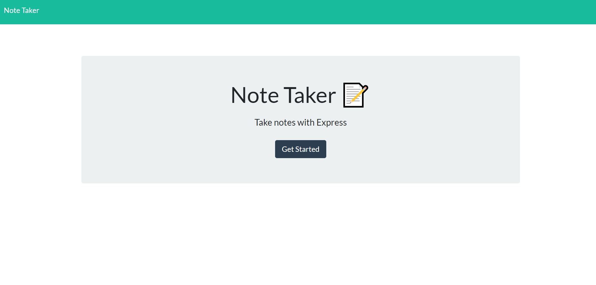
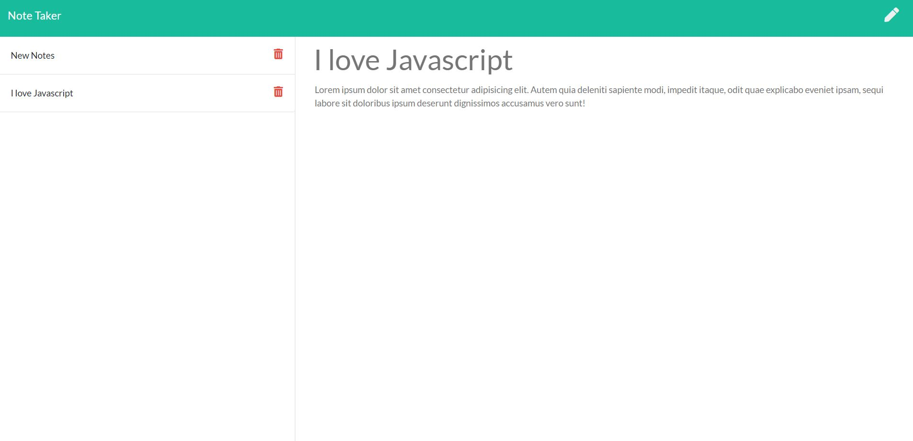

# Express Note Taker


## Badges


## License

Copyright 2020 - Max Guo. Code released under the MIT license.

## User Story
```
AS A user, I want to be able to write and save notes
I WANT to be able to delete notes I've written before
SO THAT I can organize my thoughts and keep track of tasks I need to complete
```

## Table of Content

* [Description](#Description)
* [Demo](#Demo)
* [Contributing](#Contributing)
* [Reference](#Reference)

## Description

An application that can be used to write, save, and delete notes. 
This application will use an express backend and save and retrieve note data from a JSON file.

## Demo

Main screen:

Notes Screen


## Contributing

Max, github:https://github.com/Maxguojiaq

## Reference
Bootstrap: https://getbootstrap.com/
Node File System: https://nodejs.org/api/fs.html
ExpressJS : https://expressjs.com/
NPM UUID: https://www.npmjs.com/package/uuid
